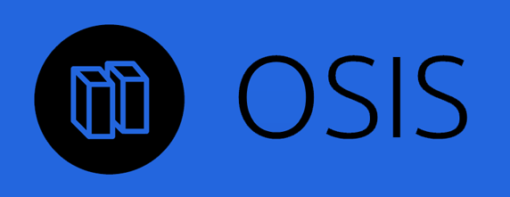

API here : [http://dvergar.github.io/osis/](http://dvergar.github.io/osis/)

**Entity Component System architecture with networking support** (for haxe).

 * Simple API
 * Simple source
 * **Networking is optional**, none of the network API is polluating the ECS
 * API support for shared code betwen client & server
 * Automatic & fine-grained serialization of components via [PODStream](https://github.com/Dvergar/PODStream)
 * Avoids magic !

(Iteration from old [ECS-Networking-Haxe](https://github.com/Dvergar/ECS-Networking-Haxe))
 
Check out [the sample](https://github.com/Dvergar/SISO/tree/master/sample-openfl) for a quick overview of the architecture. The library assumes you are in a client/server architecture where the server is authoritative.

### ECS ?

**Entity** is an aggregation of data-only **components**  
Logics are in **systems**  
**Systems** act on **components**

### Networking
* Components updates are always done from server to clients (not the opposite) and only at your demand.
* Messages are the only types of network events that can go both ways.
* In a game w/ this framework, communications should sum up to the client sending a list of pressed keys and/or events and the server dispatching everything else.

**Notes**

* Based on my network library [Anette](https://github.com/Dvergar/Anette) which is actually broken on the server websocket/JS target at the moment, OSIS is inheriting the same issue
* 64 components max, 64 entity sets max
* It's TCP, I really want UDP support so stay tuned for that
